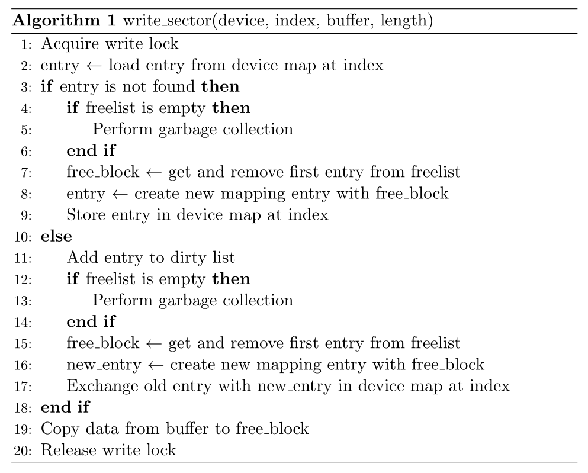
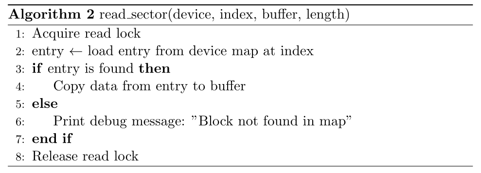
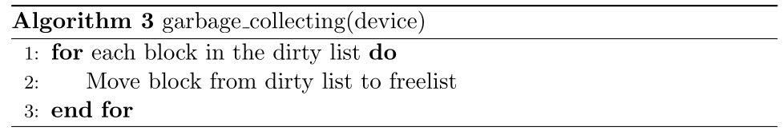
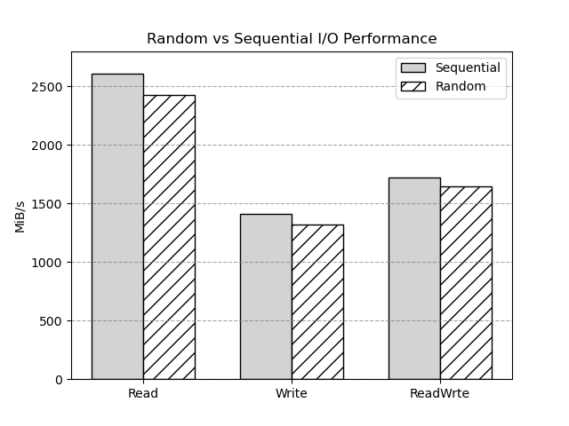
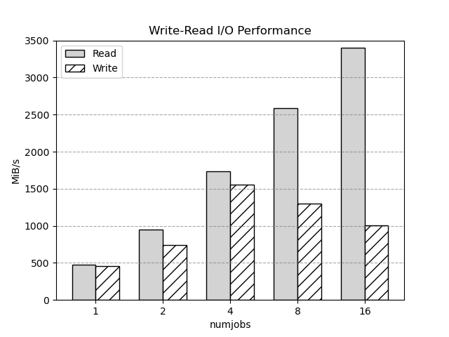
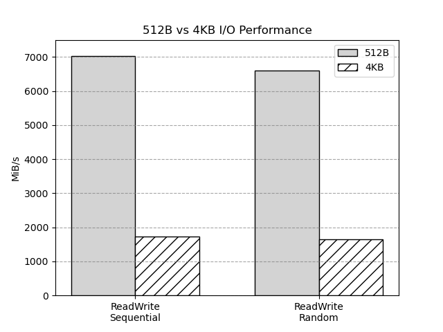
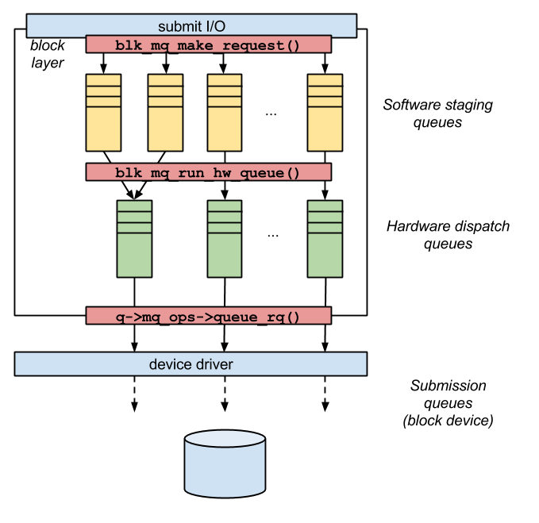

## Data Structure

### Device
본 드라이버에서 사용하는 `device`데이터 구조는 다음과 같다.

```c
struct csl_device {
	struct blk_mq_tag_set *tag_set; /* Tag set for multiqueue */
	struct gendisk *disk;		/* General disk structure */
	struct request_queue *queue;	/* Request queue */
	rwlock_t rwlock;		/* Read-write lock */
	struct xarray map;		/* Map for block index */
	struct list_head freelist;	/* Free block list */
	struct list_head dirtylist;	/* Dirty block list */
	size_t size;			/* Device capacity in sectors */
	uint8_t *data;			/* Data buffer */
};
```

기존의 데이터에서 달라진 부분은 mapping을 위한 metadata를 저장하는 `xarray`와 `freelist`, `dirtylist`이다. `xarray`는 `logical block address(LBA)`와 `physical block address(PBA)`를 매핑하기 위한 자료구조이다. `freelist`는 현재 사용되지 않는 블록(`free block`)의 리스트이다. `dirtylist`는 데이터가 변경된 블록의 리스트이다.

### Mapping Entry
`xarray`는 key로서 `unsigned int`를 사용하고 value로는 `void *`를 사용한다. 이 포인터를 통해서 mapping하고자 하는 데이터를 저장한다. 본 구현에서는 이곳에 저장할 데이터로서 다음과 같은 Data Structure를 사용했다.

```c
struct sector_mapping_entry {
    int l_idx;
    int p_idx;
};
```

이 구조체는 `l_idx`와 `p_idx`를 저장하는 구조체이다. `l_idx`는 `logical block address`를 저장하고, `p_idx`는 `physical block address`를 저장한다.

### List Entry
`freelist`와 `dirtylist`는 `list_head`를 사용하여 구현하였다. `list_head`는 linux에서 사용하는 `linked list node`로서 기능하지만, 일반적인 list와는 사뭇 다르게 사용해야 한다. 일반적인 리스의 경우에는 node struct 내부에 데이터와 다음 node에 대한 포인터를 저장한다. 그러나 `list_head`는 데이터를 저장하지 않고 다음 노드에 대한 포인터만을 저장한다. 대신 `list_head`를 사용하는 구조체가 데이터를 저장하도록 한다. 이는 `list_head`를 사용하는 구조체가 linux상에서 굉장히 많기 때문에 범용적인 활용을 지원하기 위하여 데이터와 링크를 디커플링한 것으로 이해된다. 본 디바이스에서는 list를 위한 data structure를 다음과 같이 정의하였다.

```c
struct sector_list_entry {
    int idx;
    struct list_head list;
};
```
`idx`에는 `PBA`를 저장하고 `list`에는 다음 `sector_list_entry`구조체가 포함하고 있는 `list_head`가 저장된다.

## Algorithm

### Write

write는 다음과 같은 과정을 거친다.

<p align="center">
 
</p>
<p align="center" style="font-size:125%">
 Image 1. Write Sector Pseudo code 
</p>

write 알고리즘은 다음과 같이 작동한다. 먼저, `write lock`을 획득하여 다른 프로세스나 스레드가 동시에 데이터에 접근하는 것을 방지한다. 이후, 지정된 index에서 `sector_mapping_entry`를 불러온다. 불러온 항목이 존재하지 않는 경우, 새로운 항목을 생성해야 한다. 이때, `freelist`가 비어있는지 확인한다. 만약 비어있다면, `garbage collection`을 수행하여 사용하지 않는 블록을 회수한다.

`garbage collection` 후, `freelist`에서 첫 번째 항목을 가져와서 새로운 `sector_mapping_entry`을 생성한다. 생성된 새로운 항목을 `map`의 index 위치에 저장한다.

반대로, 불러온 항목이 이미 존재하는 경우에는 해당 항목을 `dirty list`에 추가하여 더 이상 사용하지 않음을 표시한다. 이후 과정은 동일하나, `map`에 새로운 항목을 저장하는 것이 아니라 기존 항목을 변경한다,

마지막으로, buffer의 데이터를 `free block`으로 복사한 후, `write lock`을 해제한다.

### Read

<p align="center">
 
</p>
<p align="center" style="font-size:125%">
 Image 2. Read Sector Pseudo code 
</p>

read 알고리즘은 다음과 같이 작동한다. 먼저, `read lock`을 획득하여 다른 프로세스나 스레드에서 write가 일어나는 것을 방지한다. 이후, 지정된 index에서 `sector_mapping_entry`를 불러온다. 불러온 항목이 존재하지 않는 경우, 아무 작업도 수행하지 않는다. 반대로, 불러온 항목이 존재하는 경우에는 해당 항목의 `PBA`에 해당하는 데이터를 buffer로 복사한다.

마지막으로, `read lock`을 해제한다.

### Garbage Collecting

<p align="center">
 
</p>
<p align="center" style="font-size:125%"> 
 Image 3. Garbage Collecting 
</p>

`garbage collection`의 경우에는 특이한 사항없이 `dirtylist`에 있는 블록을 순회하면서 이를 `freelist`에 추가하는 과정을 반복한다.

### Parmanent

`kmalloc`이나 `vmalloc`의 경우 kernel memory에 할당되기 때문에 module의 init, exit과 무관하게 kernel space에서 유지된다. 따라서 영구적인 데이터를 위해서는 할당된 메모리의 주소를 기억하고 있는 것이 중요하다. 이를 위해서 init과정과 exit과정에서 각각 file에 read/write함을 통해서 주소를 저장하는 방식으로 이를 유지하였다.

`data buffer address`이외에도 `map`, `freelist`, `dirtylist`의 데이터 역시 저장/블러올 수 있도록 구현하였다. 이를 통해 init/exit 과정에서 해당 데이터를 저장하고 불러올 수 있도록 하였다.

## File Structure

### type.h

구현에 필요한 data structure들을 선언하는 파일이다.

### file.h

file open/close를 위해 사용되는 함수를 wrapping한 macro들을 정의하는 파일이다.

### metadata.h/metadata.c

드라이버의 작동을 위해서 필요한 `metadata`인 `data buffer address`, `map`, `freelist`, `dirtylist`를 저장하고 불러오는 API를 구현한 파일이다.

### dev.c


## Experiment

### Random VS Sequential

본 프로그램 구현상으로는 `cache`와 같은 optimization이 없기 때문에 random이나 sequential이나 전부 동일한 translation 및 data access 과정을 거칠 수 밖에 없다. 그렇기에 device에서 이를 처리하는 과정에 대해서는 동일한 workload를 가질 것으로 예측하였다.

테스트에 사용된 fio setting은 다음과 같다.

```ini
[global]
bs=512
iodepth=16
direct=1
ioengine=libaio
filename=/dev/csl
group_reporting=1
numjobs=8
time_based=1
runtime=30
size=4MB
```

<p align="center">
 
</p>
<p align="center" style="font-size:125%">
 Image 4. Random VS Sequential Comparison
</p>

실험결과 미세하게나마 sequential이 random보다 더 좋은 성능을 보이는 것을 확인할 수 있었다. 이는 드라이버의 구현상에서의 문제가 아니라 I/O Layer에서 request를 setting하는 과정에서 모종의 최적화가 일어난 것으로 추측된다.

### Read VS Write

Read는 `Reader-Writer` lock의 특성상 다수의 Reader가 `critical section`에 접근할 수 있기 때문에 numjobs가 늘어나면 늘어날수록 read가 write에 비해서 더 좋은 성능을 보인다. 

<p align="center">
 
</p>
<p align="center" style="font-size:125%">
 Image 5. Read VS Write Comparison
</p>

read의 경우에는 여러개의 reader가 동시에 접근할 수 있기 때문에 numjobs가 증가할수록 성능이 증가하는 것을 확인할 수 있었다. 그러나 write의 경우에는 `write lock`을 획득하는 과정에서 overhead가 발생하기 때문에 numjobs=4 이후로는 증가할수록 성능이 감소하는 것을 확인할 수 있었다.

## Improvement

### Block size

현재의 디바이스는 sector size와 동일한 512B 단위로 I/O를 수행하고 있다. 그러나 이는 지나치게 작은 단위이다. 디바이스가 request를 처리하는데 있어서는 크게 2개의 overhead가 발생한다. 첫번째는 `request`를 처리하기 위해서 lock을 잡거나 metadata를 처리하는 과정에서 발생하는 overhead고 나머지 하나는 실질적으로 데이터를 읽거나 쓰는 과정에서 발생하는 overhead이다. 첫번째 overhead의 경우에는 그 값이 고정되어있다. 그러나 두번째 overhead의 경우에는 데이터의 크기에 비례하게 증가한다. 따라서 데이터의 크기가 작을수록 이 첫번째 overhead가 전체 overhead의 비중이 커지게 된다. 이를 해결하기 위해서는 한번에 쓰는 데이터의 크기를 늘리는 것이 필요하다. 이를 통해 데이터의 크기가 overhead에 비해 상대적으로 커지게 되어 전체 overhead의 비중이 줄어들게 된다. 이를 통해 전체적인 성능을 향상시킬 수 있다.

실재로 본 디바이스의 sector size를 4KB로 변경하여 테스트를 진행해본 결과 다음과 같았다.

<p align="center">
 
</p>
<p align="center" style="font-size:125%">
 Image 7. Block Size Comparison
</p>

Block Size가 커짐에 따라서 Bandwith가 3.5배 가량 증가하는 것을 확인할 수 있었다.

그러나 현재 주어진 sector의 크기를 변경할 수는 없다. 대신에 연속적인 sector를 묶어서 큰 단위의 I/O를 수행하는 방법을 고려해볼 수 있다. 이를 통해 sector size를 변경하지 않고도 큰 단위의 I/O를 수행할 수 있다. 이를 위해서는 연속적인 logical data가 physical data에서도 연속적으로 매핑되도록 하는 것이 필요하다.

### Divide Lock

현재 write lock은 전체 memory에 대해서 exclusive lock을 사용하고 있다. 따라서 write가 일어나는 경우 전체 메모리는 write를 수행중인 thread에서만 접근이 가능한 상태가 된다. 그렇기에 write 연산에 대해서는 multi queue를 통한 병렬 처리의 성능이 제대로 활용되지 못하는 것이다. 이를 해결해기 위해서 write lock을 더 작은 단위로 나누어서 사용하는 방법을 고려해볼 수 있다. 전체 memory buffer를 여러 개의 작은 단위로 분할하여 각각의 작은 단위에 대해서 lock을 사용하는 방법이다. 이를 통해 write가 일어나는 경우 전체 memory가 lock되는 것이 아니라 일부 memory만 lock되는 것으로 변경할 수 있다. 이를 통해 한 구역에서 write lock이 발생하더라도 다른 구역은 별도의 작업을 수행할 수 있게 된다. 이를 통해 전체적인 성능을 향상시킬 수 있다.

### Cache

사전에 언급한 바와 같이 현재의 구현은 cache와 같은 optimization이 없다. 따라서 매번 요청이 들어올 때마다 metadata를 읽어오는 과정이 필요하다. 이는 매번 disk에 접근하는 과정이기 때문에 성능에 큰 영향을 미친다. 이를 해결하기 위해서는 metadata를 cache에 저장하는 방법을 고려해볼 수 있다. 이를 통해 매번 disk에 접근하는 과정을 줄일 수 있고, 따라서 성능을 향상시킬 수 있다.

## Discussion

### Linked List of Linux

### kmalloc vs vmalloc
이 둘의 주요 차이점은, kmalloc은 가상/물리 메모리에 연속적인 방식으로 메모리를 할당한다. 그러나 kmalloc과 유사하게 작동하지만 가상 메모리에서는 연속적으로 할당하는 반면 물리 메모리에서는 그렇지 않다는 점이다.

일반적으로 vmalloc은 물리 메모리가 아닌 가상 메모리에만 연속적으로 할당하므로 페이지 테이블에 여러 가상-물리 주소 매핑을 추가해야 하므로 커널의 성능이 더욱 느려질 수 있으므로 일반적으로는 vmalloc보다 kmalloc이 더 빠르다. 그러나 vmalloc은 물리 메모리가 연속적이지 않은 경우에도 메모리를 할당할 수 있기 때문에 더 큰 메모리 청크를 할당 할 수 있다는 장점이 있다.

### Block Level I/O Layer

```
void blk_mq_submit_bio(struct bio *bio)
```

### nr_hw_queues

Block device에서 request가 전달되는 과정을 살펴보면 다음과 같다.

<p align="center">
 
</p>
<p align="center" style="font-size:125%">
 Image 5. Hardware Queue Structure
</p>

nr_hw_queue 변수는 위의 그림의 2번째 layer에 위치한 hardware dispatch queue의 개수를 결정하는 변수이다. 이 변수는 block device의 성능에 큰 영향을 미치는 변수이다. 이 변수가 클수록 block device는 더 많은 request를 동시에 처리할 수 있게 된다. 그러나 이 변수가 클수록 lock을 획득하는 overhead가 커지게 된다. linux 내부의 다른 block device driver(e.g. `nvme`, `scsi`)들은 이 변수를 어떻게 설정하고 있는지 확인해본 결과, `possible number of CPU`와 동일하게 설정하고 있는 것을 확인할 수 있었다. 이에 따라 본 드라이버에서는 `num_possible_cpus()`를 이용하여 `nr_hw_queues`를 `CPU`의 개수와 동일하게 설정하였다.

### Semaphore vs Mutex
사실상 대부분의 core 부분의 개발이 끝난 이후에 가장 문제가 되었던 부분이다. 본 드라이버의 동기화 상황은 `Reader-Writer` case에 속한다. 이는 굉장히 유명한 경우이며 학부 수업에서도 대표적인 예제로서 다룬 바 있다. 그렇기에 수업에서 배웠던 `Semaphore`를 이용하여 이를 해결하고자 하였다. 처음에 시도하였던 동기화 구조는 다음과 같다.

```c
static void read_sector(...)
{
	down(&dev->reader_nr_mutex);
	dev->reader_nr++;
	if (dev->reader_nr == 1)
		down(&dev->rw_mutex);
	up(&dev->reader_nr_mutex);

    ...

	down(&dev->reader_nr_mutex);
	dev->reader_nr--;
	if (dev->reader_nr == 0)
		up(&dev->rw_mutex);
	up(&dev->reader_nr_mutex);
}

static void write_sector(...)
{
    down(&dev->rw_mutex);
d
    ...

	up(&dev->rw_mutex);
}
```
이 구조에서 `reader_nr_mutex`와 `rw_mutex`는 count가 1인 `semaphore`로 실질적으로는 `Mutex`의 역할과 동일하다. 그러나 이 방법을 사용하였을 때, `nr_hw_queues`가 증가하면 증가할수록 bandwidth가 급격히 감소하는 문제를 발경하였다. 이에 원인을 찾아보니 `Semaphore`는 `sleep lock`스타일로 작동하기 때문에 `Mutex`와 달리 `down`과 `up`을 호출할 때마다 `context switch`가 발생한다. 따라서 `Semaphore`를 사용하였을 때, `context switch`가 많이 발생하게 되어 성능이 급격히 감소하였다. 우리의 코드의 경우에는 최대 512B에 대한 I/O를 처리하기에 I/O에 대한 workload가 `context switch`보다 압도적으로 작다. 그렇기에 `Mutex`를 사용하는 것이 더 효율적이라고 판단하였다. `Mutex`의 경우에는 일반적으로는 `sleep lock`을 사용하지만, 코드를 확인해본 결과 몇가지 최적화를 하고있는 것을 확인할 수 있었다. 이에 대한 자세한 내용은 `Mutex`에 대한 Discussion에서 다루도록 하겠다.

이제 `reader_nr_mutex`와 `rw_mutex`를 `mutex`로 변경하였다. 변경된 구조는 다음과 같다.

```c
static void read_sector(...)
{
	mutex_lock(&dev->reader_nr_mutex);
	dev->reader_nr++;
	if (dev->reader_nr == 1)
		mutex_lock(&dev->rw_mutex);
	mutex_unlock(&dev->reader_nr_mutex);

	...

	mutex_lock(&dev->reader_nr_mutex);
	dev->reader_nr--;
	if (dev->reader_nr == 0)
		mutex_unlock(&dev->rw_mutex);
	mutex_unlock(&dev->reader_nr_mutex);
}

static void write_sector(...)
{
	mutex_lock(&dev->rw_mutex);

	...

	mutex_unlock(&dev->rw_mutex);
}
```
근본적인 구조는 유지한 상태로 `Semaphore`를 `Mutex`로 변경하였다. 테스트 결과 `nr_hw_queues`가 증가하더라도 성능이 급격히 감소하지 않았고 기존의 예상처럼 성능이 증가하였다.

추가적으로 서칭한 결과 linux에서는 별도의 `rwlock`을 제공한다. 이는 `Reader-Writer` 패턴의 동기화를 위해 사용되는 특수한 형태의 lock이다. 자세한 내용은 Discussion에서 다루도록 하겠다. 어쨌든 이를 이용하여 다음과 같은 구현으로 코드를 수정하였다.

```c
static void read_sector(...)
{
	read_lock(&dev->rwlock);

	...

	read_unlock(&dev->rwlock);
}

static void write_sector(...)
{
	write_lock(&dev->rwlock);

	...

	write_unlock(&dev->rwlock);
}
```
수행결과 `rwlock`을 사용하였을 때, `Mutex`를 사용하였을 때보다 1.5배 가량 성능향상이 있는 것을 확인할 수 있었다.

### Additional Mutex
linux의 `mutex`는 다음과 같이 정의되어 있다.
```c
struct mutex {
	atomic_long_t		owner;
	raw_spinlock_t		wait_lock;
#ifdef CONFIG_MUTEX_SPIN_ON_OWNER
	struct optimistic_spin_queue osq; /* Spinner MCS lock */
#endif
	struct list_head	wait_list;
#ifdef CONFIG_DEBUG_MUTEXES
	void			*magic;
#endif
#ifdef CONFIG_DEBUG_LOCK_ALLOC
	struct lockdep_map	dep_map;
#endif
};
```
여기서 우리가 눈여겨 볼 멤버는 `owner`, `wait_lock`, `wait_list`이다. `owner`는 `mutex`를 소유하고 있는 `task`의 `pid`를 저장하고 있다. `wait_lock`은 `mutex`를 기다리는 `task`들을 관리하는 `spinlock`이다. `wait_list`는 `wait_lock`을 통해 관리되는 `task`들의 리스트이다. 이 리스트는 `list`로 관리되며, `mutex`를 기다리는 `task`들이 이 리스트에 추가되고 제거된다.

`mutex`가 제공하는 기본적인 API는 `mutex_lock`과 `mutex_unㅉmutex_lock`의 코드를 살펴보자.

```c
void __sched mutex_lock(struct mutex *lock)
{
	might_sleep();

	if (!__mutex_trylock_fast(lock))
		__mutex_lock_slowpath(lock);
}
```

여기서 `might_sleep`이후의 `__mutex_trylock_fast`에 주목하자. 해당 코드는 다음과 같이 구현되어 있다.

```c
static __always_inline bool __mutex_trylock_fast(struct mutex *lock)
{
	unsigned long curr = (unsigned long)current;
	unsigned long zero = 0UL;

	if (atomic_long_try_cmpxchg_acquire(&lock->owner, &zero, curr))
		return true;

	return false;
}
```
`atomic_long_try_cmpxchg_acquire`함수는 `unsinged long`의 값을 `atomic`하게 `compare and exchange`하는 함수이다. 이 함수는 `lock->owner`가 `0`이면 `curr`로 값을 바꾸고 `true`를 반환한다. 그렇지 않으면 `false`를 반환한다. 이 과정이 atomic하게 이루어지기 때문에 별도의 `spinlock`이 필요하지 않다. 이를 통해 `mutex`의 소유권을 빠르게 얻을 수 있다.

`fast path`를 통과하지 못하였다면, 이제는 다음 단계로 넘어가야 한다. 이 부분이 `__mutex_lock_slowpath`이다. 이 코드의 경우에는 상당히 긴 코드이기에 본 보고서에 전체 코드를 담지는 않고 부분적으로 살펴보도록 하겠다. `__mutex_lock_slowpath`를 크게 두 부분으로 나누면 `optimistic spinning`과 `contention`이다. `optimistic spinning`은 `spinlock`을 사용하여 `mutex`를 얻으려는 시도이다. `contention`은 `spinlock`을 얻지 못하였을 때, `wait_list`에 `task`를 추가하고 `schedule`을 호출하여 `task`를 `sleep`시키는 과정이다.

먼저 `optimistic spinning`을 살펴보자.

```c
if (__mutex_trylock(lock) ||
    mutex_optimistic_spin(lock, ww_ctx, NULL)) {
	/* got the lock, yay! */
	lock_acquired(&lock->dep_map, ip);
	if (ww_ctx)
		ww_mutex_set_context_fastpath(ww, ww_ctx);
	trace_contention_end(lock, 0);
	preempt_enable();
	return 0;
}
```

`spinlock`의 경우에는 CPU의 점유를 놓지않고 `lock`을 얻으려고 하는 `busy-lock`이기 때문에 `critical section`이 짧은 코드에 적합하다. 따라서 `mutex`에서도 바로 `sleeplock`을 적용하기 이전에 `spinlock`으로 `mutex`를 얻으려고 시도한다. 이를 `optimistic spinning`이라고 한다. `optimistic spinning`을 통해 `mutex`를 얻을 수 있다면 `sleeplock`을 사용하지 않고 `mutex`를 얻을 수 있다. 이를 통해 `context switch`를 줄일 수 있다. 이러한 시도를 `mid path`라고 칭한다.

위의 시도가 전부 실패하였다면, 이제는 `contention`으로 넘어가야 한다. `contention`은 `spinlock`을 얻지 못하였을 때, `wait_list`에 `task`를 추가하고 `schedule`을 호출하여 `task`를 `sleep`시키는 과정이다. 이 과정은 `slow path`라고 칭한다. 여기서부터는 `sleeplock`을 사용하여 `mutex`를 얻는다.

이제 `mutex`의 `unlock`을 살펴보자. nulock도 마찬가지로 `fast path`와 `slow path`로 나누어진다. `fast path`는 다음과 같다.

```c
```
즉, 다음으로 실행할 `task`를 지정하지 않고 atomic하게 `owner`를 `0`으로 만들어 다음 `task`가 `mutex`를 얻을 수 있도록 한다. 이 과정은 `spinlock`을 사용하지 않는다. 이를 통해 빠르게 `mutex`를 해제할 수 있다. 이렇게 해제된 lock은 `fast path`나 `mid path`를 통해 경쟁적으로 `mutex`를 얻을 수 있다.

반면에 `slow path`는 다음과 같다.

```c
```
이 경우에는 `wait_list`에 있는 `task`들을 깨우고 `mutex`를 해제한다.

### rwlock in linux

<a name="footnote_1">1</a>: https://junsoolee.gitbook.io/linux-insides-ko/summary/syncprim/linux-sync-4