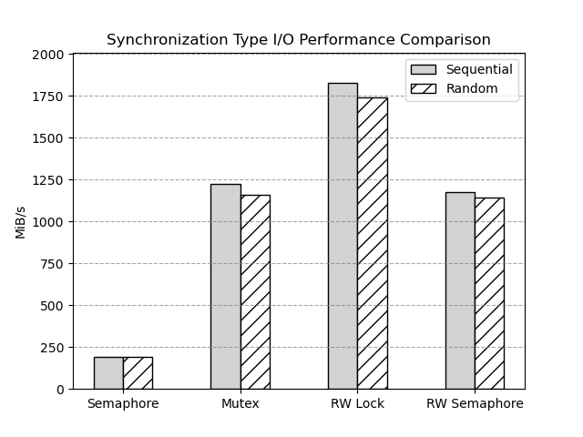

# CSL Report 2 - Append Only Virtual Block Storage Device

* 1. [Data Structure](#DataStructure)
	* 1.1. [Device](#Device)
	* 1.2. [Mapping Entry](#MappingEntry)
	* 1.3. [List Entry](#ListEntry)
* 2. [Algorithm](#Algorithm)
	* 2.1. [Write](#Write)
	* 2.2. [Read](#Read)
	* 2.3. [Garbage Collecting](#GarbageCollecting)
	* 2.4. [Parmanent](#Parmanent)
* 3. [File Structure](#FileStructure)
	* 3.1. [type.h](#type.h)
	* 3.2. [file.h](#file.h)
	* 3.3. [metadata.h/metadata.c](#metadata.hmetadata.c)
	* 3.4. [dev.c](#dev.c)
* 4. [test](#test)
	* 4.1. [Read/Write](#ReadWrite)
	* 4.2. [Synchronization](#Synchronization)
	* 4.3. [Save/Load Metadata](#SaveLoadMetadata)
	* 4.4. [Display Mapping](#DisplayMapping)
* 5. [Experiment](#Experiment)
	* 5.1. [Random VS Sequential](#RandomVSSequential)
	* 5.2. [Read VS Write](#ReadVSWrite)
* 6. [Improvement](#Improvement)
	* 6.1. [Block size](#Blocksize)
	* 6.2. [Divide Lock](#DivideLock)
	* 6.3. [Cache](#Cache)
* 7. [Discussion](#Discussion)
	* 7.1. [Linked List of Linux](#LinkedListofLinux)
	* 7.2. [kmalloc vs vmalloc](#kmallocvsvmalloc)
	* 7.3. [Block Level I/O Layer](#BlockLevelIOLayer)
	* 7.4. [nr_hw_queues](#nr_hw_queues)
	* 7.5. [Semaphore vs Mutex](#SemaphorevsMutex)
	* 7.6. [Additional Mutex](#AdditionalMutex)
	* 7.7. [rwlock in linux](#rwlockinlinux)

##  1. <a name='DataStructure'></a>Data Structure

###  1.1. <a name='Device'></a>Device
본 드라이버에서 사용하는 `device`데이터 구조는 다음과 같다.

```c
struct csl_device {
	struct blk_mq_tag_set *tag_set; /* Tag set for multiqueue */
	struct gendisk *disk;		/* General disk structure */
	struct request_queue *queue;	/* Request queue */
	rwlock_t rwlock;		/* Read-write lock */
	struct xarray map;		/* Map for block index */
	struct list_head freelist;	/* Free block list */
	struct list_head dirtylist;	/* Dirty block list */
	size_t size;			/* Device capacity in sectors */
	uint8_t *data;			/* Data buffer */
};
```

기존의 데이터에서 달라진 부분은 mapping을 위한 metadata를 저장하는 `xarray`와 `freelist`, `dirtylist`이다. `xarray`는 `logical block address(LBA)`와 `physical block address(PBA)`를 매핑하기 위한 자료구조이다. `freelist`는 현재 사용되지 않는 블록(`free block`)의 리스트이다. `dirtylist`는 데이터가 변경된 블록의 리스트이다.

###  1.2. <a name='MappingEntry'></a>Mapping Entry
`xarray`는 key로서 `unsigned int`를 사용하고 value로는 `void *`를 사용한다. 이 포인터를 통해서 mapping하고자 하는 데이터를 저장한다. 본 구현에서는 이곳에 저장할 데이터로서 다음과 같은 Data Structure를 사용했다.

```c
struct sector_mapping_entry {
    int l_idx;
    int p_idx;
};
```

이 구조체는 `l_idx`와 `p_idx`를 저장하는 구조체이다. `l_idx`는 `logical block address`를 저장하고, `p_idx`는 `physical block address`를 저장한다.

###  1.3. <a name='ListEntry'></a>List Entry
`freelist`와 `dirtylist`는 `list_head`를 사용하여 구현하였다. `list_head`는 linux에서 사용하는 `linked list node`로서 기능하지만, 일반적인 list와는 사뭇 다르게 사용해야 한다. 일반적인 리스의 경우에는 node struct 내부에 데이터와 다음 node에 대한 포인터를 저장한다. 그러나 `list_head`는 데이터를 저장하지 않고 다음 노드에 대한 포인터만을 저장한다. 대신 `list_head`를 사용하는 구조체가 데이터를 저장하도록 한다. 이는 `list_head`를 사용하는 구조체가 linux상에서 굉장히 많기 때문에 범용적인 활용을 지원하기 위하여 데이터와 링크를 디커플링한 것으로 이해된다. 자세한 내용은 후술할 [Discussion](#LinkedListofLinux)에서 다루도록 하겠다. 본 디바이스에서는 list를 위한 data structure를 다음과 같이 정의하였다.

```c
struct sector_list_entry {
    int idx;
    struct list_head list;
};
```
`idx`에는 `PBA`를 저장하고 `list`에는 다음 `sector_list_entry`구조체가 포함하고 있는 `list_head`가 저장된다.

##  2. <a name='Algorithm'></a>Algorithm

###  2.1. <a name='Write'></a>Write

write는 다음과 같은 과정을 거친다.

<p align="center">
 
</p>
<p align="center" style="font-size:125%">
 Image 1. Write Sector Pseudo code 
</p>

write 알고리즘은 다음과 같이 작동한다. 먼저, `write lock`을 획득하여 다른 프로세스나 스레드가 동시에 데이터에 접근하는 것을 방지한다. 이후, 지정된 index에서 `sector_mapping_entry`를 불러온다. 불러온 항목이 존재하지 않는 경우, 새로운 항목을 생성해야 한다. 이때, `freelist`가 비어있는지 확인한다. 만약 비어있다면, `garbage collection`을 수행하여 사용하지 않는 블록을 회수한다.

`garbage collection` 후, `freelist`에서 첫 번째 항목을 가져와서 새로운 `sector_mapping_entry`을 생성한다. 생성된 새로운 항목을 `map`의 index 위치에 저장한다.

반대로, 불러온 항목이 이미 존재하는 경우에는 해당 항목을 `dirty list`에 추가하여 더 이상 사용하지 않음을 표시한다. 이후 과정은 동일하나, `map`에 새로운 항목을 저장하는 것이 아니라 기존 항목을 변경한다,

마지막으로, buffer의 데이터를 `free block`으로 복사한 후, `write lock`을 해제한다.

###  2.2. <a name='Read'></a>Read

<p align="center">
 
</p>
<p align="center" style="font-size:125%">
 Image 2. Read Sector Pseudo code 
</p>

read 알고리즘은 다음과 같이 작동한다. 먼저, `read lock`을 획득하여 다른 프로세스나 스레드에서 write가 일어나는 것을 방지한다. 이후, 지정된 index에서 `sector_mapping_entry`를 불러온다. 불러온 항목이 존재하지 않는 경우, 아무 작업도 수행하지 않는다. 반대로, 불러온 항목이 존재하는 경우에는 해당 항목의 `PBA`에 해당하는 데이터를 buffer로 복사한다.

마지막으로, `read lock`을 해제한다.

###  2.3. <a name='GarbageCollecting'></a>Garbage Collecting

<p align="center">
 
</p>
<p align="center" style="font-size:125%"> 
 Image 3. Garbage Collecting 
</p>

`garbage collection`의 경우에는 특이한 사항없이 `dirtylist`에 있는 블록을 순회하면서 이를 `freelist`에 추가하는 과정을 반복한다.

###  2.4. <a name='Parmanent'></a>Parmanent

`kmalloc`이나 `vmalloc`의 경우 kernel memory에 할당되기 때문에 module의 init, exit과 무관하게 kernel space에서 유지된다. 따라서 영구적인 데이터를 위해서는 할당된 메모리의 주소를 기억하고 있는 것이 중요하다. 이를 위해서 init과정과 exit과정에서 각각 file에 read/write함을 통해서 주소를 저장하는 방식으로 이를 유지하였다.

`data buffer address`이외에도 `map`, `freelist`, `dirtylist`의 데이터 역시 저장/블러올 수 있도록 구현하였다. 이를 통해 init/exit 과정에서 해당 데이터를 저장하고 불러올 수 있도록 하였다.

##  3. <a name='FileStructure'></a>File Structure

###  3.1. <a name='type.h'></a>type.h

`type.h` 파일은 디바이스 드라이버 구현에 필요한 데이터 구조를 선언하는 파일이다. 이 파일은 `csl_device`, `sector_mapping_entry`, `sector_list_entry`등 드라이버의 운영에 필수적인 다양한 타입과 구조체를 정의한다.

###  3.2. <a name='file.h'></a>file.h

file.h 파일은 파일 open/close를 위한 wrapping 매크로들을 정의하는 파일이다. 이러한 매크로들은 파일 조작 과정을 단순화하여 코드의 가독성과 유지보수성을 높인다. 파일 조작을 매크로로 추상화함으로써 일관성을 유지하고 파일 처리에서의 오류 가능성을 줄인다. 

###  3.3. <a name='metadata.hmetadata.c'></a>metadata.h/metadata.c

`metadata.h`와 `metadata.c` 파일은 드라이버의 작동을 위해 필요한 메타데이터를 저장하고 불러오는 API를 구현한 파일이다. 메타데이터에는 `data buffer address`, `map`, `free list`, `dirty list`이 포함된다. 이 데이터들은 driver의 consistency를 위해서 반드시 보관되어야하므로 local에 저장되어 module init될 때 불러오고 exit될 때 저장되어야 한다. 이를 위해서 init과 	exit에서 메타데이터 저장하는 기능을 해당 파일에 구현하였다.

해당 파일의 핵심적인 함수는 다음과 같다.	

```c
int initialize_memory(struct csl_device *dev);
int initialize_metadata(struct csl_device *dev);
int load_metadata(struct csl_device *dev, int reset_device);
void save_metadata(struct csl_device *dev);
```

###  3.4. <a name='dev.c'></a>dev.c

`dev.c` 파일은 디바이스 드라이버의 주요 기능을 구현하는 파일이다. 이 파일은 `read`, `write`, `garbage collecting`과 같은 기능을 드라이브 핵심 기능을 구현하고 있으며, 또한 `init`과 `exit`와 같이 드라이버의 생명주기를 관리하는 기능을 구현하고 있다.

##  4. <a name='test'></a>test

종합적인 test를 위해서 testcode를 구현하였다. 처음에는 ubuntu c에서는 `O_DIRECT` flag를 사용할 수 없어서 `rust`를 사용하여 test를 진행하였다. 그러나 이후 `GNU C`에서는 `O_DIRECT` flag를 사용할 수 있음을 확인하였다. 따라서 이후 test는 `GNU C`를 사용하여 진행하였다.

```c
#define DEBUG_MESSAGE(fmt, ...) \
	if (IS_ENABLED(DEBUG))  \
		printk(KERN_INFO pr_fmt(fmt), ##__VA_ARGS__)
```
위와 같이 `DEBUG` option이 define된 경우에만 출력하는 매크로를 이용하여 동작여부를 확인하였다. 또한 `__reset_device`라는 parameter를 만들어서 필요에 따라 device의 모든 data를 초기화시킬 수 있도록 하였다.

###  4.1. <a name='ReadWrite'></a>Read/Write

가장 먼저 디바이스에 대해서 `read`와 `write`를 수행하는 테스트를 진행하였다. 이를 통해서 디바이스가 정상적으로 동작하는지 확인하였다.

이를 위해서 사용한 C 코드는 다음과 같다.

```c
void write_data(int fd, off_t offset, const void *data, size_t size) {
    if (lseek(fd, offset, SEEK_SET) == (off_t)-1) {
        perror("lseek");
        exit(EXIT_FAILURE);
    }
    if (write(fd, data, size) != size) {
        perror("write");
        exit(EXIT_FAILURE);
    }

    fsync(fd);
}

void read_data(int fd, off_t offset, void *data, size_t size) {
    if (lseek(fd, offset, SEEK_SET) == (off_t)-1) {
        perror("lseek");
        exit(EXIT_FAILURE);
    }
    if (read(fd, data, size) != size) {
        perror("read");
        exit(EXIT_FAILURE);
    }

    fsync(fd);
}

void print_test_result(const char *test_name, int success) {
    if (success) {
        printf("\033[0;32m[✔] %s passed\033[0m\n", test_name);
    } else {
        printf("\033[0;31m[✘] %s failed\033[0m\n", test_name);
    }
}

void single_thread_write_test(int fd) {
    char *write_buffer;

    if (posix_memalign((void **)&write_buffer, SECTOR_SIZE, SECTOR_SIZE)) {
        perror("posix_memalign");
        close(fd);
        exit(EXIT_FAILURE);
    }

    memset(write_buffer, 0xAA, SECTOR_SIZE);

    int success = 1;
    for (int i = 0; i < NUM_SECTORS; i++) {
        off_t offset = i * SECTOR_SIZE;
        write_data(fd, offset, write_buffer, SECTOR_SIZE);
    }

    print_test_result("Single thread write test", success);
    free(write_buffer);
}

void single_thread_read_test(int fd) {
    char *write_buffer;
    char *read_buffer;

    if (posix_memalign((void **)&write_buffer, SECTOR_SIZE, SECTOR_SIZE)) {
        perror("posix_memalign");
        close(fd);
        exit(EXIT_FAILURE);
    }

    if (posix_memalign((void **)&read_buffer, SECTOR_SIZE, SECTOR_SIZE)) {
        perror("posix_memalign");
        free(write_buffer);
        close(fd);
        exit(EXIT_FAILURE);
    }

    memset(write_buffer, 0xAA, SECTOR_SIZE);

    int success = 1;
    for (int i = 0; i < NUM_SECTORS; i++) {
        off_t offset = i * SECTOR_SIZE;
        memset(read_buffer, 0, SECTOR_SIZE);
        read_data(fd, offset, read_buffer, SECTOR_SIZE);

        if (memcmp(write_buffer, read_buffer, SECTOR_SIZE) != 0) {
            success = 0;
            fprintf(stderr, "Data verification failed at offset %ld in single thread\n", offset);
            break;
        }
    }

    print_test_result("Single thread read test", success);
    free(write_buffer);
    free(read_buffer);
}
```

먼저 `dev/csl`을 direct I/O를 수행하기 위해서 `O_DIRECT` flag를 사용하여 open하고, 이후 `write`와 `read`를 수행하는 코드이다. 이를 통해서 디바이스가 정상적으로 동작하는지 확인하였다.

해당 test를 수행한 이후 kernel log는 다음과 같다.

<p align="center">
 
</p>

정상적으로 logic address와 physical address가 mapping되는 것을 확인할 수 있었다.

fio에 대해서는 다음과 같은 테스트를 진행했다.
```ini
[global]
bs=512
iodepth=1
direct=1
ioengine=libaio
filename=/dev/csl
group_reporting=1
numjobs=1
size=16MB
```

이는 device에 대해서 16MB의 데이터를 512B 단위로 sequential write를 수행하는 테스트이다. 이를 통해서 device 전체에 대해서 write가 정상적으로 수행되는지 확인하였다. 수행결과 이상없이 프로그램이 동작하는 것을 확인할 수 있었다.

###  4.2. <a name='Synchronization'></a>Synchronization

다음으로는 `synchronization`에 대한 테스트를 진행하였다. 본 디바이스는 `Reader-Writer` lock을 사용하여 동시에 여러개의 reader가 접근할 수 있도록 하였다. 이를 확인하기 위해서 `Reader-Writer` lock을 사용하여 동시에 여러개의 reader가 접근할 수 있는지 확인하였다.

이를 위해서 사용한 코드는 다음과 같다.

```c
void *multithread_test_device(void *threadarg) {
    thread_data_t *data = (thread_data_t *)threadarg;
    int fd = data->fd;
    int thread_id = data->thread_id;
    pthread_mutex_t *mutex = data->mutex;

    char *write_buffer;
    char *read_buffer;

    if (posix_memalign((void **)&write_buffer, SECTOR_SIZE, SECTOR_SIZE)) {
        perror("posix_memalign");
        close(fd);
        pthread_exit(NULL);
    }

    if (posix_memalign((void **)&read_buffer, SECTOR_SIZE, SECTOR_SIZE)) {
        perror("posix_memalign");
        free(write_buffer);
        close(fd);
        pthread_exit(NULL);
    }

    memset(write_buffer, 0xAA + thread_id, SECTOR_SIZE);

    int success = 1;
    for (int i = 0; i < NUM_SECTORS; i++) {
        off_t offset = i * SECTOR_SIZE;

        pthread_mutex_lock(mutex);

        write_data(fd, offset, write_buffer, SECTOR_SIZE);

        memset(read_buffer, 0, SECTOR_SIZE);
        read_data(fd, offset, read_buffer, SECTOR_SIZE);

        if (memcmp(write_buffer, read_buffer, SECTOR_SIZE) != 0) {
            success = 0;
            fprintf(stderr, "Data verification failed at offset %ld in thread %d\n", offset, thread_id);
            break;
        }

        pthread_mutex_unlock(mutex);
    }

    char test_name[50];
    snprintf(test_name, sizeof(test_name), "Multithread test in thread %d", thread_id);
    print_test_result(test_name, success);

    free(write_buffer);
    free(read_buffer);

    pthread_exit(NULL);
}
```

이 코드는 `pthread`를 사용하여 여러개의 thread가 동시에 device에 접근하는 것을 테스트하는 코드이다. 이를 통해서 `Reader-Writer` lock이 정상적으로 동작하는지 확인하였다. 수행결과 이상없이 프로그램이 동작하는 것을 확인할 수 있었다.

###  4.3. <a name='SaveLoadMetadata'></a>Save/Load Metadata

본 디바이스는 data consistency를 위해서 metadata를 저장하고 불러오는 기능을 구현하였다. 이를 확인하기 위해서 디버깅 모드에서는 metadata를 불러왔을 때 해당 정보를 출력하도록 하였다. 이를 통해서 metadata가 정상적으로 저장되고 불러와지는지 확인하였다.

먼저 read/write를 수행한 후의 device의 metadata를 출력한 결과는 다음과 같다.

<p align="center">
 
</p>

이후, device를 unload한 후 다시 load한 후의 kernel log는 다음과 같다.

<p align="center">
 
</p>

확인결과 metadata가 정상적으로 저장되고 불러와지는 것을 확인할 수 있었다.

###  4.4. <a name='DisplayMapping'></a>Display Mapping

`dev.c`에 메타데이터의 정합성을 디버깅하기 위해서 `map`, `freelist`, `dirtylist`의 정보를 출력하는 함수인 `print_metadata`함수를 구현하였다. 해당 함수는 `map` 데이터를 table 형태로 출력하고, `freelist`와 `dirtylist`는 현재 저장된 데이터의 갯수만을 출력한다. 실행 결과는 다음과 같다.

<p align="center">
 
</p>

##  5. <a name='Experiment'></a>Experiment

###  5.1. <a name='RandomVSSequential'></a>Random VS Sequential

본 프로그램 구현상으로는 `cache`와 같은 optimization이 없기 때문에 random이나 sequential이나 전부 동일한 translation 및 data access 과정을 거칠 수 밖에 없다. 그렇기에 device에서 이를 처리하는 과정에 대해서는 동일한 workload를 가질 것으로 예측하였다.

테스트에 사용된 fio setting은 다음과 같다.

```ini
[global]
bs=512
iodepth=16
direct=1
ioengine=libaio
filename=/dev/csl
group_reporting=1
numjobs=8
time_based=1
runtime=30
size=4MB
```

<p align="center">
 
</p>
<p align="center" style="font-size:125%">
 Image 4. Random VS Sequential Comparison
</p>

실험결과 미세하게나마 sequential이 random보다 더 좋은 성능을 보이는 것을 확인할 수 있었다. 이는 드라이버의 구현상에서의 문제가 아니라 I/O Layer에서 request를 setting하는 과정에서 cache를 사용하여 최적화를 하고 있기에 발생하는 차이로 보인다. 대표적으로 `submit_bio`함수에서 `bio`를 `request`로 변환해서 `request_queue`로 전달하는 과정에서 `blk_mq_peek_cached_request`를 통해서 cache된 `request`가 있는지 확인하는 optimization이 있다.

###  5.2. <a name='ReadVSWrite'></a>Read VS Write
Read는 `Reader-Writer` lock의 특성상 다수의 Reader가 `critical section`에 접근할 수 있기 때문에 numjobs가 늘어나면 늘어날수록 read가 write에 비해서 더 좋은 성능을 보인다. 

<p align="center">
 
</p>
<p align="center" style="font-size:125%">
 Image 5. Read VS Write Comparison
</p>

read의 경우에는 여러개의 reader가 동시에 접근할 수 있기 때문에 numjobs가 증가할수록 성능이 증가하는 것을 확인할 수 있었다. 그러나 write의 경우에는 1개의 writer만이 접근가능해야 하므로 numjobs가 증가하여도 1명의 writer만이 쓸 수 있으며 오히려 지나치게 많아지는 경우에는 `write lock`을 획득하는 과정에서 overhead가 과다하게 발생하기 때문에 numjobs=4 이후로는 성능이 감소하는 것을 확인할 수 있었다.

##  6. <a name='Improvement'></a>Improvement

###  6.1. <a name='Blocksize'></a>Block size

현재의 디바이스는 sector size와 동일한 512B 단위로 I/O를 수행하고 있다. 그러나 이는 지나치게 작은 단위이다. 디바이스가 request를 처리하는데 있어서는 크게 2개의 overhead가 발생한다. 첫번째는 `request`를 처리하기 위해서 lock을 잡거나 metadata를 처리하는 과정에서 발생하는 overhead고 나머지 하나는 실질적으로 데이터를 읽거나 쓰는 과정에서 발생하는 overhead이다. 첫번째 overhead의 경우에는 그 값이 고정되어있다. 그러나 두번째 overhead의 경우에는 데이터의 크기에 비례하게 증가한다. 따라서 데이터의 크기가 작을수록 이 첫번째 overhead가 전체 overhead의 비중이 커지게 된다. 이를 해결하기 위해서는 한번에 쓰는 데이터의 크기를 늘리는 것이 필요하다. 이를 통해 데이터의 크기가 overhead에 비해 상대적으로 커지게 되어 전체 overhead의 비중이 줄어들게 된다. 이를 통해 전체적인 성능을 향상시킬 수 있다.

실재로 본 디바이스의 sector size를 4KB로 변경하여 테스트를 진행해본 결과 다음과 같았다.

<p align="center">
 
</p>
<p align="center" style="font-size:125%">
 Image 6. Block Size Comparison
</p>

테스트 환경은 다음과 같다.
```ini
[global]
iodepth=16
direct=1
ioengine=libaio
filename=/dev/csl
group_reporting=1
numjobs=4
time_based=1
runtime=10
size=4MB
```

Block Size가 커짐에 따라서 Bandwith가 4.5배 가량 증가하는 것을 확인할 수 있었다.

그러나 주어진 sector의 크기를 변경할 수는 없다. 대신에 연속적인 sector를 묶어서 큰 단위의 I/O를 수행하는 방법을 고려해볼 수 있다. 이를 통해 sector size를 변경하지 않고도 큰 단위의 I/O를 수행할 수 있다. 이를 위해서는 연속적인 logical data가 physical data에서도 연속적으로 매핑되도록 하는 것이 필요하다.

###  6.2. <a name='DivideLock'></a>Divide Lock

현재 write lock은 전체 memory에 대해서 exclusive lock을 사용하고 있다. 따라서 write가 일어나는 경우 전체 메모리는 write를 수행중인 thread에서만 접근이 가능한 상태가 된다. 그렇기에 write 연산에 대해서는 multi queue를 통한 병렬 처리의 성능이 제대로 활용되지 못하는 것이다. 이를 해결해기 위해서 write lock을 더 작은 단위로 나누어서 사용하는 방법을 고려해볼 수 있다. 전체 memory buffer를 여러 개의 작은 단위로 분할하여 각각의 작은 단위에 대해서 lock을 사용하는 방법이다. 이를 통해 write가 일어나는 경우 전체 memory가 lock되는 것이 아니라 일부 memory만 lock되는 것으로 변경할 수 있다. 이를 통해 한 구역에서 write lock이 발생하더라도 다른 구역은 별도의 작업을 수행할 수 있게 된다. 이를 통해 전체적인 성능을 향상시킬 수 있다.

###  6.3. <a name='Cache'></a>Cache

사전에 언급한 바와 같이 현재의 구현은 cache와 같은 optimization이 없다. 따라서 매번 요청이 들어올 때마다 metadata를 읽어오는 과정이 필요하다. 따라서 이러한 overhead를 줄이기 위해서는 cache를 도입하는 것도 고려해볼수 있다. cache를 도입함으로써 metadata를 더 빠르게 읽어올 수 있게 되고 이를 통해 전체적인 성능을 향상시킬 수 있을 것이다.

##  7. <a name='Discussion'></a>Discussion

해당 부분은 본 프로젝트를 진행하면서 알게된 linux의 다양한 기능들에 대해서 다루고자 한다. 이를 통해서 linux의 다양한 기능들에 대해서 이해하고 이를 통해 성능을 향상시킬 수 있는 방법에 대해서 고민해보고자 한다.

###  7.1. <a name='LinkedListofLinux'></a>Linked List of Linux

`linked list`는 linux에서 매우 많이 사용되는 자료구조이다. 그러나 전통적인 구현으로는 list를 사용하는 구조체마다 개별적인 list API를 가져야만 하였다. 그래서 linux에서는 이를 통합하여 강력한 list API를 제공하기 위해 `container_of`를 이용한 list 시스템을 구현하였다. `container_of`의 구현은 다음과 같다.

```c
#define container_of(ptr, type, member) ({				\
	void *__mptr = (void *)(ptr);					\
	static_assert(__same_type(*(ptr), ((type *)0)->member) ||	\
		      __same_type(*(ptr), void),			\
		      "pointer type mismatch in container_of()");	\
	((type *)(__mptr - offsetof(type, member))); })
```
먼저 첫 줄의 `void *__mptr = (void *)(ptr);`를 보자. `ptr`은 `member`가 포함되어 있는 구조체의 포인터이다. 이를 `void *`로 형변환하여 `__mptr`에 저장한다. 다음 줄에서는  `static_assert`를 통해서 `ptr`이 `type`의 `member`에 대한 포인터인지 확인하고 있다. 만약 이 조건이 만족하지 않는다면 컴파일 에러를 발생시킨다. 마지막으로 `__mptr`에서 `member`의 offset만큼 뺀 주소를 반환한다. 이 offset은 `offsetof`를 통해서 구할 수 있다. 이 `offsetof`의 구현은 다음과 같다.

```c
#define offsetof(TYPE, MEMBER) ((size_t) &((TYPE *)0)->MEMBER)
```
`offsetof`은 `TYPE`의 `MEMBER`가 시작하는 offset을 구하는 매크로이다. 이는 메모리 주소 0에 대해서 MEMBER 만큼의 offset을 더한 주소를 반환함을 통해서 offset을 빠르게 구할 수 있다.

이러한 `container_of`와 `offsetof`를 통해서 linux는 구조체마다 개별적인 list 구현이 필요없이 강력한 list API를 제공할 수 있게 되었다.

###  7.2. <a name='kmallocvsvmalloc'></a>kmalloc vs vmalloc
이 둘의 주요 차이점은, kmalloc은 가상/물리 메모리에 연속적인 방식으로 메모리를 할당한다. 그러나 kmalloc과 유사하게 작동하지만 가상 메모리에서는 연속적으로 할당하는 반면 물리 메모리에서는 그렇지 않다는 점이다.

일반적으로 vmalloc은 물리 메모리가 아닌 가상 메모리에만 연속적으로 할당하므로 페이지 테이블에 여러 가상-물리 주소 매핑을 추가해야 하므로 커널의 성능이 더욱 느려질 수 있으므로 일반적으로는 vmalloc보다 kmalloc이 더 빠르다. 그러나 vmalloc은 물리 메모리가 연속적이지 않은 경우에도 메모리를 할당할 수 있기 때문에 더 큰 메모리 청크를 할당 할 수 있다는 장점이 있다.

###  7.3. <a name='BlockLevelIOLayer'></a>Block Level I/O Layer

linux의 `Block Level I/O Layer`의 개괄은 다음과 같다.

<p align="center">
 
</p>
<p align="center" style="font-size:125%">
 Image 7. Block Level I/O Layer

이 과정에서 `Block Layer`에 실질적으로 진입하는 부분은 `submit_bio`함수이다. 이 함수는 `bio`를 받아서 `request`로 변환하고 이를 `block device`에 전달하는 역할을 한다. 하지만 실질적으로 코어 로직을 담고있는 함수는 `blk_mq_submit_bio`이다. 이곳에서 `bio`가 `request`로 변환되고 `request`가 `block device`의 `hardware queue`에 전달되는 과정을 거친다. `blk_mq_submit_bio`의 핵심적인 부분만 살펴보면 다음과 같다.

```c
void blk_mq_submit_bio(struct bio *bio)
{
	// cache된 request가 있는지 확인한다.
	rq = blk_mq_peek_cached_request(plug, q, bio->bi_opf);

	...

new_request:
	if (!rq) {
		// cache된 request가 없는 경우 새로운 request를 생성한다.
		rq = blk_mq_get_new_requests(q, plug, bio, nr_segs);
		if (unlikely(!rq))
			goto queue_exit;
	} else {
		// cache된 request가 있는 경우 해당 request를 사용한다.
		blk_mq_use_cached_rq(rq, plug, bio);
	}

	...

	// bio를 request로 변환한다.
	blk_mq_bio_to_request(rq, bio, nr_segs);

	...

	hctx = rq->mq_hctx;
	// request가 scheduler를 사용하거나 hardware context가 busy하면서 request의 hw queue가 1개이거나 sync가 아닌 경우
	if ((rq->rq_flags & RQF_USE_SCHED) ||
	    (hctx->dispatch_busy && (q->nr_hw_queues == 1 || !is_sync))) {
		// request를 request queue에 삽입한다.
		blk_mq_insert_request(rq, 0);
		blk_mq_run_hw_queue(hctx, true);
	} else {
		// request를 request queue에 넣치않고 device driver에 바로 전달한다.
		blk_mq_run_dispatch_ops(q, blk_mq_try_issue_directly(hctx, rq));
	}
	return;

	...
}
```

`blk_mq_submit_bio`는 준비된 `request`를 크게 2방향으로 나눠서 device에 전달한다. 첫번째는 `request`를 `request queue`에 삽입하고 `hardware queue`를 실행하는 방법이다. `blk_mq_run_hw_queue`가 이 역할을 담당하고 있다. 두번째는 `request`를 `device driver`에 바로 전달하는 방법이다. 이 방법은 `request`를 `hardware queue`에 삽입하지 않고 `device driver`에 바로 전달하는 방법이다. `blk_mq_try_issue_directly`가 이 역할을 담당하고 있다.

먼저 `blk_mq_run_hw_queue`의 중요 부분만 살펴보면 다음과 같다.

```c
void blk_mq_run_hw_queue(struct blk_mq_hw_ctx *hctx, bool async)
{
	...

	if (async || !cpumask_test_cpu(raw_smp_processor_id(), hctx->cpumask)) {
		blk_mq_delay_run_hw_queue(hctx, 0);
		return;
	}

	blk_mq_run_dispatch_ops(hctx->queue,
				blk_mq_sched_dispatch_requests(hctx));
}
```

먼저 함수는 `async`이거나 `cpumask`에 현재 CPU가 포함되어 있지 않은 경우 `blk_mq_delay_run_hw_queue`를 호출한다. 이 함수는 cpu의 `workqueue`에 `htcx`의 `run_work`를 enqueue하는 함수이다. `hctx`의 `run_work`에는 `blk_mq_run_work_fn`가 등록되어있다. 이 함수의 구현은 다음과 같다.

```c
void blk_mq_sched_dispatch_requests(struct blk_mq_hw_ctx *hctx)
{
	...

	/*
	 * A return of -EAGAIN is an indication that hctx->dispatch is not
	 * empty and we must run again in order to avoid starving flushes.
	 */
	if (__blk_mq_sched_dispatch_requests(hctx) == -EAGAIN) {
		if (__blk_mq_sched_dispatch_requests(hctx) == -EAGAIN)
			blk_mq_run_hw_queue(hctx, true);
	}
}
```
`__blk_mq_sched_dispatch_requests`를 실행하고 결과가 `-EAGAIN`이면 다시 한번 실행한다. 재실행한 결과가 `-EAGAIN`이면 `blk_mq_run_hw_queue`를 다시 호출한다.

따라서 핵심적인 코드는 `__blk_mq_sched_dispatch_requests`에 위치해 있다. 이 함수의 구현의 핵심적인 부분은 다음과 같다.

```c
static int __blk_mq_sched_dispatch_requests(struct blk_mq_hw_ctx *hctx)
{
	...

	if (!list_empty(&rq_list)) {
		blk_mq_sched_mark_restart_hctx(hctx);
		if (!blk_mq_dispatch_rq_list(hctx, &rq_list, 0))
			return 0;
		need_dispatch = true;
	} else {
		need_dispatch = hctx->dispatch_busy;
	}

	if (hctx->queue->elevator)
		return blk_mq_do_dispatch_sched(hctx);

	/* dequeue request one by one from sw queue if queue is busy */
	if (need_dispatch)
		return blk_mq_do_dispatch_ctx(hctx);
	blk_mq_flush_busy_ctxs(hctx, &rq_list);
	blk_mq_dispatch_rq_list(hctx, &rq_list, 0);
	return 0;
}
```
`__blk_mq_sched_dispatch_requests`는 3가지 경우로 나뉜다. 첫번째는 `rq_list`가 비어있지 않은 경우이다. 이 경우에는 `blk_mq_dispatch_rq_list`를 호출한다. 이 함수는 `hardware queue`의 `rq_queue`를 호출한다. 즉, `request handler`를 호출함을 통해서 현재 hardware의 `request list`를 처리한다. 두번째는 `rq_list`가 비어있는 경우이다. 이 경우에는 `software queue`의 `request`가 아직 `hardware queue`에 전달되지 않았다는 것을 의미한다. 이 경우에는 `blk_mq_do_dispatch_ctx`를 호출한다. 이 함수는 `software queue`에 있는 `request`를 하나씩 `hardware queue`에 전달하는 역할을 한다. 세번째는 `elevator`가 있는 경우이다. 이 경우에는 `blk_mq_do_dispatch_sched`를 호출한다. 이 함수는 `elevator`를 통해서 `request`를 처리하는 역할을 한다.

다시 `blk_mq_run_hw_queue`함수로 돌아가자. Synchronous하게 실행해야 하는 경우 별도로 `workqueue`에 추가하지 않고 direct하게 `blk_mq_sched_dispatch_requests`를 호출한다.

따라서 block device의 request가 전달되어 실행되는 과정은 다음과 같다.


<p align="center" style="font-size:125%">
 Fig 1. Block Device Request Handling Flowchart
</p>

###  7.4. <a name='nr_hw_queues'></a>nr_hw_queues

Block device에서 request가 전달되는 과정을 살펴보면 다음과 같다.

<p align="center">
 
</p>
<p align="center" style="font-size:125%">
 Image 8. Hardware Queue Structure
</p>

nr_hw_queue 변수는 위의 그림의 2번째 layer에 위치한 hardware dispatch queue의 개수를 결정하는 변수이다. 이 변수는 block device의 성능에 큰 영향을 미치는 변수이다. 이 변수가 클수록 block device는 더 많은 request를 동시에 처리할 수 있게 된다. 그러나 이 변수가 클수록 lock을 획득하는 overhead가 커지게 된다. linux 내부의 다른 block device driver(e.g. `nvme`, `scsi`)들은 이 변수를 어떻게 설정하고 있는지 확인해본 결과, `possible number of CPU`와 동일하게 설정하고 있는 것을 확인할 수 있었다. 이에 따라 본 드라이버에서는 `num_possible_cpus()`를 이용하여 `nr_hw_queues`를 `CPU`의 개수와 동일하게 설정하였다.

###  7.5. <a name='SemaphorevsMutex'></a>Semaphore vs Mutex
사실상 대부분의 core 부분의 개발이 끝난 이후에 가장 문제가 되었던 부분이다. 본 드라이버의 동기화 상황은 `Reader-Writer` case에 속한다. 이는 굉장히 유명한 경우이며 학부 수업에서도 대표적인 예제로서 다룬 바 있다. 그렇기에 수업에서 배웠던 `Semaphore`를 이용하여 이를 해결하고자 하였다. 처음에 시도하였던 동기화 구조는 다음과 같다.

```c
static void read_sector(...)
{
	down(&dev->reader_nr_mutex);
	dev->reader_nr++;
	if (dev->reader_nr == 1)
		down(&dev->rw_mutex);
	up(&dev->reader_nr_mutex);

    ...

	down(&dev->reader_nr_mutex);
	dev->reader_nr--;
	if (dev->reader_nr == 0)
		up(&dev->rw_mutex);
	up(&dev->reader_nr_mutex);
}

static void write_sector(...)
{
    down(&dev->rw_mutex);
d
    ...

	up(&dev->rw_mutex);
}
```
이 구조에서 `reader_nr_mutex`와 `rw_mutex`는 count가 1인 `semaphore`로 실질적으로는 `Mutex`의 역할과 동일하다. 그러나 이 방법을 사용하였을 때, `nr_hw_queues`가 증가하면 증가할수록 bandwidth가 급격히 감소하는 문제를 발경하였다. 이에 원인을 찾아보니 `Semaphore`는 `sleep lock`스타일로 작동하기 때문에 `Mutex`와 달리 `down`과 `up`을 호출할 때마다 `context switch`가 발생한다. 따라서 `Semaphore`를 사용하였을 때, `context switch`가 많이 발생하게 되어 성능이 급격히 감소하였다. 우리의 코드의 경우에는 최대 512B에 대한 I/O를 처리하기에 I/O에 대한 workload가 `context switch`보다 압도적으로 작다. 그렇기에 `Mutex`를 사용하는 것이 더 효율적이라고 판단하였다. `Mutex`의 경우에는 일반적으로는 `sleep lock`을 사용하지만, 코드를 확인해본 결과 몇가지 최적화를 하고있는 것을 확인할 수 있었다. 이에 대한 자세한 내용은 `Mutex`에 대한 Discussion에서 다루도록 하겠다.

이제 `reader_nr_mutex`와 `rw_mutex`를 `mutex`로 변경하였다. 변경된 구조는 다음과 같다.

```c
static void read_sector(...)
{
	mutex_lock(&dev->reader_nr_mutex);
	dev->reader_nr++;
	if (dev->reader_nr == 1)
		mutex_lock(&dev->rw_mutex);
	mutex_unlock(&dev->reader_nr_mutex);

	...

	mutex_lock(&dev->reader_nr_mutex);
	dev->reader_nr--;
	if (dev->reader_nr == 0)
		mutex_unlock(&dev->rw_mutex);
	mutex_unlock(&dev->reader_nr_mutex);
}

static void write_sector(...)
{
	mutex_lock(&dev->rw_mutex);

	...

	mutex_unlock(&dev->rw_mutex);
}
```
근본적인 구조는 유지한 상태로 `Semaphore`를 `Mutex`로 변경하였다. 테스트 결과 `nr_hw_queues`가 증가하더라도 성능이 급격히 감소하지 않았고 기존의 예상처럼 성능이 증가하였다.

추가적으로 서칭한 결과 linux에서는 별도의 `rwlock`을 제공한다. 이는 `Reader-Writer` 패턴의 동기화를 위해 사용되는 특수한 형태의 lock이다. 자세한 내용은 Discussion에서 다루도록 하겠다. 어쨌든 이를 이용하여 다음과 같은 구현으로 코드를 수정하였다.

```c
static void read_sector(...)
{
	read_lock(&dev->rwlock);

	...

	read_unlock(&dev->rwlock);
}

static void write_sector(...)
{
	write_lock(&dev->rwlock);

	...

	write_unlock(&dev->rwlock);
}
```

구체적인 성능차이에 대해서 비교해보도록 하겠다. fio를 통해서 `read`, `write`, `readwrite`에 대한 성능을 비교해보았다. 테스트 환경은 다음과 같다.

```ini
[global]
bs=512
iodepth=16
direct=1
ioengine=libaio
filename=/dev/csl
group_reporting=1
time_based=1
runtime=10
numjobs=8
size=4MB
```

먼저 `read`에 대한 성능을 살펴보면 다음과 같다.
<p align="center">
 
</p>
<p align="center" style="font-size:125%">
 Image 9. Synchronization Read Performance Comparison
</p>

예상대로 `semaphore`를 사용하였을 때 성능이 급격히 하락하는 것을 관측할 수 있었다. `mutex`를 사용하였을 때는 `semaphore`정도로 차이가 급격하지는 않았으나 `rwlock`이나 `rw semaphore`에 비해서 대략 1.5배 가량의 차이를 보였다. 이는 `mutex`가 가지고 있는 optimization에 의해서 생기는 overload로 발생한 문제로 추측된다. `rwlock`과 `rw semaphore`의 경우에는 `Reader-Writer` 패턴에 특화된 lock이기 때문에 이러한 optimization이 되어있는 것으로 추측된다. 개중에서는 `rwlock`이 미세하게 더 좋은 성능을 보였다.

다음으로 `write`에 대한 성능을 살펴보면 다음과 같다.
<p align="center">
 
</p>
<p align="center" style="font-size:125%">
 Image 10. Synchronization Write Performance Comparison
</p>

`read`와 마찬가지로 `semaphore`가 압도적으로 나쁜 성능을 보였고 `mutex`가 중간 정도의 성능을 보였으며 `rwlock`과 `rw semaphore`이 가장 좋은 성능을 보였다. 그러나 `mutex`와 `rwlock`/`rw semaphore`의 성능차이가 `read`에 비해서 감소하는 것을 볼 수 있었는데, 이는 `write`의 경우에는 mutual exclusion을 반드시 보장해야 하기 때문에 `mutex`의 lock을 잡는데 걸리는 시간이 `read`에 비해서 덜 중요하게 작용하여 발생한 것으로 추측된다.

마지막으로 전반적인 I/O에 대한 성능을 살펴보면 다음과 같다.
<p align="center">
 
</p>
<p align="center" style="font-size:125%">
 Image 11. Synchronization I/O Performance Comparison
</p>

`read`와 `write`의 성능을 종합한 결과이다. 기존의 `read`와 `write`의 결과와 마찬가지로 `semaphore`가 가장 나쁜 성능을 보이고 `mutex`가 중간 정도의 성능을 보였으며 `rwlock`이 가장 좋은 성능을 보인 것은 동일하지만 `rw semaphore`의 경우에는 `rwlock`에 비해서 성능이 확연히 감소하여 `mutex`와 비슷한 수준으로 떨어지는 것을 확인할 수 있었다. 이에 대한 자세한 논의는 `rwlock`과 `rw semaphore`에 대한 [Discussion](#rwlockinlinux)에서 다루도록 하겠다.

###  7.6. <a name='AdditionalMutex'></a>Additional Mutex
linux의 `mutex`는 다음과 같이 정의되어 있다.
```c
struct mutex {
	atomic_long_t		owner;
	raw_spinlock_t		wait_lock;
#ifdef CONFIG_MUTEX_SPIN_ON_OWNER
	struct optimistic_spin_queue osq; /* Spinner MCS lock */
#endif
	struct list_head	wait_list;
#ifdef CONFIG_DEBUG_MUTEXES
	void			*magic;
#endif
#ifdef CONFIG_DEBUG_LOCK_ALLOC
	struct lockdep_map	dep_map;
#endif
};
```
여기서 우리가 눈여겨 볼 멤버는 `owner`, `wait_lock`, `wait_list`이다. `owner`는 `mutex`를 소유하고 있는 `task`의 `pid`를 저장하고 있다. `wait_lock`은 `mutex`를 기다리는 `task`들을 관리하는 `spinlock`이다. `wait_list`는 `wait_lock`을 통해 관리되는 `task`들의 리스트이다. 이 리스트는 `list`로 관리되며, `mutex`를 기다리는 `task`들이 이 리스트에 추가되고 제거된다.

`mutex`가 제공하는 기본적인 API는 `mutex_lock`과 `mutex_unlock`의 코드를 살펴보자.

```c
void __sched mutex_lock(struct mutex *lock)
{
	might_sleep();

	if (!__mutex_trylock_fast(lock))
		__mutex_lock_slowpath(lock);
}
```

여기서 `might_sleep`이후의 `__mutex_trylock_fast`에 주목하자. 해당 코드는 다음과 같이 구현되어 있다.

```c
static __always_inline bool __mutex_trylock_fast(struct mutex *lock)
{
	unsigned long curr = (unsigned long)current;
	unsigned long zero = 0UL;

	if (atomic_long_try_cmpxchg_acquire(&lock->owner, &zero, curr))
		return true;

	return false;
}
```
`atomic_long_try_cmpxchg_acquire`함수는 `unsinged long`의 값을 `atomic`하게 `compare and exchange`하는 함수이다. 이 함수는 `lock->owner`가 `0`이면 `curr`로 값을 바꾸고 `true`를 반환한다. 그렇지 않으면 `false`를 반환한다. 이 과정이 atomic하게 이루어지기 때문에 별도의 `spinlock`이 필요하지 않다. 이를 통해 `mutex`의 소유권을 빠르게 얻을 수 있다.

`fast path`를 통과하지 못하였다면, 이제는 다음 단계로 넘어가야 한다. 이 부분이 `__mutex_lock_slowpath`이다. 이 코드의 경우에는 상당히 긴 코드이기에 본 보고서에 전체 코드를 담지는 않고 부분적으로 살펴보도록 하겠다. `__mutex_lock_slowpath`를 크게 두 부분으로 나누면 `optimistic spinning`과 `contention`이다. `optimistic spinning`은 `spinlock`을 사용하여 `mutex`를 얻으려는 시도이다. `contention`은 `spinlock`을 얻지 못하였을 때, `wait_list`에 `task`를 추가하고 `schedule`을 호출하여 `task`를 `sleep`시키는 과정이다.

먼저 `optimistic spinning`을 살펴보자.

```c
if (__mutex_trylock(lock) ||
    mutex_optimistic_spin(lock, ww_ctx, NULL)) {
	/* got the lock, yay! */
	lock_acquired(&lock->dep_map, ip);
	if (ww_ctx)
		ww_mutex_set_context_fastpath(ww, ww_ctx);
	trace_contention_end(lock, 0);
	preempt_enable();
	return 0;
}
```

`spinlock`의 경우에는 CPU의 점유를 놓지않고 `lock`을 얻으려고 하는 `busy-lock`이기 때문에 `critical section`이 짧은 코드에 적합하다. 따라서 `mutex`에서도 바로 `sleeplock`을 적용하기 이전에 `spinlock`으로 `mutex`를 얻으려고 시도한다. 이를 `optimistic spinning`이라고 한다. `optimistic spinning`을 통해 `mutex`를 얻을 수 있다면 `sleeplock`을 사용하지 않고 `mutex`를 얻을 수 있다. 이를 통해 `context switch`를 줄일 수 있다. 이러한 시도를 `mid path`라고 칭한다.

위의 시도가 전부 실패하였다면, 이제는 `contention`으로 넘어가야 한다. `contention`은 `spinlock`을 얻지 못하였을 때, `wait_list`에 `task`를 추가하고 `schedule`을 호출하여 `task`를 `sleep`시키는 과정이다. 이 과정은 `slow path`라고 칭한다. 여기서부터는 `sleeplock`을 사용하여 `mutex`를 얻는다.

이제 `mutex`의 `unlock`을 살펴보자. nulock도 마찬가지로 `fast path`와 `slow path`로 나누어진다. `fast path`는 다음과 같다.

```c
static __always_inline bool __mutex_unlock_fast(struct mutex *lock)
{
	unsigned long curr = (unsigned long)current;

	return atomic_long_try_cmpxchg_release(&lock->owner, &curr, 0UL);
}
```
즉, 다음으로 실행할 `task`를 지정하지 않고 atomic하게 `owner`를 `0`으로 만들어 다음 `task`가 `mutex`를 얻을 수 있도록 한다. 이 과정은 `spinlock`을 사용하지 않는다. 이를 통해 빠르게 `mutex`를 해제할 수 있다. 이렇게 해제된 lock은 `fast path`나 `mid path`를 통해 경쟁적으로 `mutex`를 얻을 수 있다.

반면에 `slow path`는 다음과 같다.

```c
static noinline void __sched __mutex_unlock_slowpath(struct mutex *lock, unsigned long ip)
{
	struct task_struct *next = NULL;
	DEFINE_WAKE_Q(wake_q);
	unsigned long owner;

	mutex_release(&lock->dep_map, ip);

	// mid path
	owner = atomic_long_read(&lock->owner);
	for (;;) {
		MUTEX_WARN_ON(__owner_task(owner) != current);
		MUTEX_WARN_ON(owner & MUTEX_FLAG_PICKUP);

		if (owner & MUTEX_FLAG_HANDOFF)
			break;

		if (atomic_long_try_cmpxchg_release(&lock->owner, &owner, __owner_flags(owner))) {
			if (owner & MUTEX_FLAG_WAITERS)
				break;

			return;
		}
	}

	// slow path
	raw_spin_lock(&lock->wait_lock);
	debug_mutex_unlock(lock);
	if (!list_empty(&lock->wait_list)) {
		/* get the first entry from the wait-list: */
		struct mutex_waiter *waiter =
			list_first_entry(&lock->wait_list,
					 struct mutex_waiter, list);

		next = waiter->task;

		debug_mutex_wake_waiter(lock, waiter);
		wake_q_add(&wake_q, next);
	}

	if (owner & MUTEX_FLAG_HANDOFF)
		__mutex_handoff(lock, next);

	raw_spin_unlock(&lock->wait_lock);

	wake_up_q(&wake_q);
}
```
`slow path`에서도 다시 `mid path`와 `slow path`로 나눠서 동작한다. `mid path`는 `spinlock`을 사용하여 `mutex`를 해제하는 과정이다. 이과정이 실패하게 되면 `mutex`는 `slow path`로 진입하게 된다. `slow path`는 `sleeplock`을 사용하여 `mutex`를 해제하는 과정이다. `slow path`는 전통적인 `sleep lock`의 해제 방법을 사용한다. 이를 통해 `mutex`를 해제하고 `wait_list`에 있는 `task`를 깨우는 과정을 거친다.

###  7.7. <a name='rwlockinlinux'></a>rwlock in linux
`Reader-Writer`패턴은 매우 일반적인 synchronize 패턴이다. 리눅스에서는 이 패턴에 대해서 대응하기 위해 `rwlock_t`과 `rw_semaphore`라는 두 가지 구조체를 제공한다. 이 두 구조체는 `Reader-Writer` 패턴에 대한 동기화를 위해 사용된다. 먼저 `rwlock_t`에 대해서 살펴보자.

`rwlock_t`는 다음과 같이 정의되어 있다.

```c
typedef struct {
	arch_rwlock_t raw_lock;
#ifdef CONFIG_DEBUG_SPINLOCK
	unsigned int magic, owner_cpu;
	void *owner;
#endif
#ifdef CONFIG_DEBUG_LOCK_ALLOC
	struct lockdep_map dep_map;
#endif
} rwlock_t;
```

각종 디버깅 옵션을 제외하고는 `arch_rwlock_t`가 `rwlock_t`의 핵심이다. `arch_rwlock_t`는 아키텍처에 따라 다르게 정의되어 있다. `arch_rwlock_t`는 현재 시스템의 아키텍처에 따라 다르게 정의되어 있다. 현재 본인의 환경인 x86의 경우에는 별도로 `arch_rwlock_t`가 정의되어 있지 않다. 대신 `include/asm-generic/qrwlock_types.h`에 정의되어있는 `arch_rwlock_t`를 사용하고 있다. 이는 다음과 같이 정의되어 있다.

```c
typedef struct qrwlock {
	union {
		atomic_t cnts;
		struct {
#ifdef __LITTLE_ENDIAN
			u8 wlocked;	/* Locked for write? */
			u8 __lstate[3];
#else
			u8 __lstate[3];
			u8 wlocked;	/* Locked for write? */
#endif
		};
	};
	arch_spinlock_t		wait_lock;
} arch_rwlock_t;
```

특징적인 것은 내부에 존재하는 `union` 구조체이다. 이 구조체는 `Reader`의 수를 나타내는 `cnts`와 `wlocked`와 `__lstate`로 구성된 구조체를 `union`으로 묶어서 같은 메모리 공간을 사용하도록 구성하고 있다. `atomic_t`가 실질적으로는 `int`의 크기와 동일하다는 것을 고려한다면 `wlocked`와 `__lstate`는 `cnt`를 4부분으로 나누어 각각의 부분에 접근할 수 있는 변수임을 알 수 있다. 이러한 구조가 어떻게 사용되는지는 `rwlock`의 API를 통해 살펴보도록 하겠다.

`rwlock`의 API는 아키텍처에 독립적으로 존재해야하나 그 구현은 아키텍처에 의존적이다. 따라서 굉장히 복잡하게 얽혀있어서 이를 분석하는 것이 어려웠으나 `x86`의 경우에는 `qrwlock.h`에 존재하는 `qrwlock API`가 가장 핵심적인 부분이라고 할 수 있다. 이 API는 다음과 같이 정의되어 있다. 일단 `read lock`과 관련된 API만 살펴보도록 하겠다.
```c
static inline void queued_read_lock(struct qrwlock *lock)
{
	int cnts;

	cnts = atomic_add_return_acquire(_QR_BIAS, &lock->cnts);
	if (likely(!(cnts & _QW_WMASK)))
		return;

	/* The slowpath will decrement the reader count, if necessary. */
	queued_read_lock_slowpath(lock);
}

static inline void queued_read_unlock(struct qrwlock *lock)
{
	/*
	 * Atomically decrement the reader count
	 */
	(void)atomic_sub_return_release(_QR_BIAS, &lock->cnts);
}
```
여기서 주목활 부분은 `atomic_add_return_acquire`이다. 이 함수의 prototype은 다음과 같다.
```c
atomic_add_return(int i, atomic_t *v)
```
이 함수의 역할은 `atomic_t` 포인터 `v`의 값을 `@v`에서 `(@v + @i)` atomic하게 업데이트 해주는 것이다. 이후에 업데이트한 값을 반환한다. 그렇다면 이 함수는 `rwlock`의 `Reader Counter`에 `_QR_BIAS`를 atomic하게 더해주는 함수로 볼 수 있다. `_QR_BIAS`는 `_QR_BIAS	(1U << _QR_SHIFT)`로 정의되어 있고 `_QR_SHIFT`는 9로 정의되어 있다. 즉 이 함수는 `Reader Counter`의 처음 8비트를 건너뛰고 `Counter`에 더해주는 역할을 수행하고 있다. 이제 다시 `qrwlock`의 구조를 보면 `wlocked`가 처음 8비트를 사용하고 있음을 알 수 있다. `read lock`의 경우에는 `wlocked`를 건드리지 않으면서 `Reader Counter`를 업데이트하고 있다. 따라서 `__lstate`의 역할이 실질적인 `Reader Counter`를 나타내는 것임을 알 수 있다.

계속해서 `read lock`을 분석하면 이렇게 얻은 값을 `_QW_WMASK`와 `&`연산을 수행하고 있다. `_QW_WMASK`는 `0x1ff`로 정의되어 있고, 이는 `cnt`의 `wlocked`부분과 `__lstate`의 처음 1비트를 마스킹하고 있다. 이중에서 `0x0ff`의 경우에는 현재 `Writer`가 lock을 잡고 있는지를 나타내는 비트로 `#define	_QW_LOCKED	0x0ff`로 정의되어있다. 또한 1비트의 경우에는 `#define	_QW_WAITING	0x100`로 정의되어 있는데, 이는 현재 `Writer`가 pending 상태에 있음을 알리는 비트이다. 따라서 `Reader Counter`는 `Writer`가 lock을 잡고 있지 않거나 `Writer`가 대기중이 아닐 때 `Reader Counter`를 빠르게 잡을 수 있다. 그렇지 않으면 `slow path`로 넘어가게 된다.

```c
void __lockfunc queued_read_lock_slowpath(struct qrwlock *lock)
{
	if (unlikely(in_interrupt())) {
		atomic_cond_read_acquire(&lock->cnts, !(VAL & _QW_LOCKED));
		return;
	}
	atomic_sub(_QR_BIAS, &lock->cnts);

	trace_contention_begin(lock, LCB_F_SPIN | LCB_F_READ);

	arch_spin_lock(&lock->wait_lock);
	atomic_add(_QR_BIAS, &lock->cnts);

	atomic_cond_read_acquire(&lock->cnts, !(VAL & _QW_LOCKED));

	arch_spin_unlock(&lock->wait_lock);

	trace_contention_end(lock, 0);
}
```
`slow path`에서는 우선 `fast path`에서 시도했던 덧셈 연산을 `atomic_sub`를 통해서 취소하고 `writer`가 lock을 놓기를 기다리는 lock인 `wait lock`에 스스로를 추가함을 통해서 `writer`가 lock을 놓기를 기다린다. 이 때 사용하는 lock이 `arch_spinlock_t`으로 정의되어 있었던 `wait_lock`이다. 이후 `writer`가 lock을 풀었다면 이전과 동일하게 `_QR_BIAS`를 더해주고 `Reader Counter`를 업데이트하여 `read lock`을 잡는다.

`unlock`의 경우에는 비교적 단순하게 `Reader Counter`를 `atomic_sub`를 통해서 업데이트하고 있다.

`write lock`의 경우에는 다음과 같이 정의되어 있다.
```c
static inline void queued_write_lock(struct qrwlock *lock)
{
	int cnts = 0;
	/* Optimize for the unfair lock case where the fair flag is 0. */
	if (likely(atomic_try_cmpxchg_acquire(&lock->cnts, &cnts, _QW_LOCKED)))
		return;

	queued_write_lock_slowpath(lock);
}

static inline void queued_write_unlock(struct qrwlock *lock)
{
	smp_store_release(&lock->wlocked, 0);
}
```

위의 `read lock`과 구조가 거의 비슷하면서도 일부 다른 지점이 있다. 먼저 `read lock`에서는 `atomic_add`를 통해서 `Reader Counter`를 업데이트하는 방식이었다면 여기서는 `atomic_try_cmpxchg_acquire`를 통해서 `cnt`변수가 0인지를 확인하고 만일 그러하다면 `Writer`가 lock을 잡았다는 표식인 `_QW_LOCKED`로 변경하도록 하고있다. `cnt`변수가 0이라는 것은 `Reader`나 `Writer`둘다 lock을 잡지 않았다는 것을 의미한다. 따라서 `Writer`가 lock을 잡을 수 있다. 그렇지 않으면 `slow path`로 넘어가게 된다.

```c
void __lockfunc queued_write_lock_slowpath(struct qrwlock *lock)
{
	int cnts;

	trace_contention_begin(lock, LCB_F_SPIN | LCB_F_WRITE);

	/* Put the writer into the wait queue */
	arch_spin_lock(&lock->wait_lock);

	/* Try to acquire the lock directly if no reader is present */
	if (!(cnts = atomic_read(&lock->cnts)) &&
	    atomic_try_cmpxchg_acquire(&lock->cnts, &cnts, _QW_LOCKED))
		goto unlock;

	/* Set the waiting flag to notify readers that a writer is pending */
	atomic_or(_QW_WAITING, &lock->cnts);

	/* When no more readers or writers, set the locked flag */
	do {
		cnts = atomic_cond_read_relaxed(&lock->cnts, VAL == _QW_WAITING);
	} while (!atomic_try_cmpxchg_acquire(&lock->cnts, &cnts, _QW_LOCKED));
unlock:
	arch_spin_unlock(&lock->wait_lock);

	trace_contention_end(lock, 0);
}
```

먼저 `waiting queue`에 스스로를 등록하기 위해서 `wait_lock`를 잡는다. 차례가 온다면 현재의 `cnts`를 읽어서 local 변수 `cnts`에 저장한다. 만일 `cnts`가 0이라면 빠르게 lock을 잡을 수 있으므로 `write lock`을 잡고 `unlock`으로 넘어간다. 그렇지 않으면 `waiting flag`를 설정하고 `Reader`들에게 `Writer`가 pending 상태임을 알린다. 이렇게 되면 `Reader`들은 `fast path`를 사용하지 못하고 `slow path`로 넘어가 `wait list`에 등록된다. 그 다음으로는 `do-while`문을 이용하여 lock을 잡을 때까지 `busy-wait`를 수행한다. 이 과정이 끝나면 `unlock`으로 넘어가게 된다.

`unlock`의 경우에는 `wlocked`를 0으로 만들어주는 것으로 `Writer`가 lock을 풀었음을 알린다.

위의 구현에서 볼 수 있듯이 `rwlock_t`는 근본적으로 `spinlock`방식으로 동작한다. 따라서 만일 우리의 디바이스의 `sector`연산이 충분히 커져서 `context switch`의 overhead를 덮을 수 있을 정도가 된다면 `rwlock`보다는 다른 방식의 synchronize 방법을 사용하는 것이 더 효율적일 수 있다. 그러나 현재의 상황에서는 그렇게 I/O단위가 크지 않기에 `rwlock`이 가장 적합한 방법이라고 볼 수 있다.

참고로 개별적으로 정의되어있는 시스템의 예시로는 `arm`이 있다. `arm`의 경우에는 `arch_rwlock_t`가 다음과 같이 정의되어 있다.

```c
typedef struct {
	u32 lock;
} arch_rwlock_t;
```

`rw_semaphore`의 경우에는 `rwlock_t`와 비슷한 역할을 수행하지만 그 근본이 `semaphore`이기에 내부 구현은 차이가 있다. `rw_semaphore`의 경우에는 `CONFIG_PREEMPT_RT`옵션에 따라서 그 구현이 다르다. 그러나 본 환경에서는 이 옵션이 켜져있지 않은것으로 확인되었기에 이를 기준으로 작성하겠다.

`rw_semaphore`의 경우에는 다음과 같이 정의되어 있다.

```c
struct rw_semaphore {
	atomic_long_t count;
	/*
	 * Write owner or one of the read owners as well flags regarding
	 * the current state of the rwsem. Can be used as a speculative
	 * check to see if the write owner is running on the cpu.
	 */
	atomic_long_t owner;
#ifdef CONFIG_RWSEM_SPIN_ON_OWNER
	struct optimistic_spin_queue osq; /* spinner MCS lock */
#endif
	raw_spinlock_t wait_lock;
	struct list_head wait_list;
#ifdef CONFIG_DEBUG_RWSEMS
	void *magic;
#endif
#ifdef CONFIG_DEBUG_LOCK_ALLOC
	struct lockdep_map	dep_map;
#endif
};
```
여기서도 잡다한 디버깅 옵션을 제외하고는 `count`, `owner`, `wait_lock`, `wait_list`가 가장 핵심적인 부분이다. `count`는 `Reader`의 수를 나타내는 변수이다. `owner`는 `Writer`의 상태를 나타내는 변수이다. `wait_lock`은 `Reader`와 `Writer`가 `rw_semaphore`를 기다리는 `spinlock`이다. `wait_list`는 `wait_lock`을 통해 관리되는 `task`들의 리스트이다.

`rw_semaphore`의 API역시 다양한 매크로와 함수로 wrapping되어있지만 핵심적인 부분만 발췌하여 살펴보도록 하겠다. 먼저 `read lock`에서 lock을 잡는 과정은 다음과 같다.

```c
static __always_inline int __down_read_common(struct rw_semaphore *sem, int state)
{
	int ret = 0;
	long count;

	preempt_disable();
	if (!rwsem_read_trylock(sem, &count)) {
		if (IS_ERR(rwsem_down_read_slowpath(sem, count, state))) {
			ret = -EINTR;
			goto out;
		}
		DEBUG_RWSEMS_WARN_ON(!is_rwsem_reader_owned(sem), sem);
	}
out:
	preempt_enable();
	return ret;
}
```

우선적으로 눈에 띄는 것은 `preempt_disable`/`preempt_enable`함수이다. 이 함수들은 스케줄링을 지원하는 함수의 실행 금지/허가하는 함수들이다. 즉 `__sched` attribute의 함수의 실행을 차단하는 역할을 수행한다. 이후 `rwsem_read_trylock`을 통해서 `read lock`을 잡을 수 있는지를 확인하고 있다. 만일 이 시도가 실패하였다면 `slow path`로 넘어가게 된다.

```c
static struct rw_semaphore __sched *
rwsem_down_read_slowpath(struct rw_semaphore *sem, long count, unsigned int state)
{
	long adjustment = -RWSEM_READER_BIAS;
	long rcnt = (count >> RWSEM_READER_SHIFT);
	struct rwsem_waiter waiter;
	DEFINE_WAKE_Q(wake_q);

	if ((atomic_long_read(&sem->owner) & RWSEM_READER_OWNED) &&
	    (rcnt > 1) && !(count & RWSEM_WRITER_LOCKED))
		goto queue;

	if (!(count & (RWSEM_WRITER_LOCKED | RWSEM_FLAG_HANDOFF))) {
		rwsem_set_reader_owned(sem);
		lockevent_inc(rwsem_rlock_steal);

		if ((rcnt == 1) && (count & RWSEM_FLAG_WAITERS)) {
			raw_spin_lock_irq(&sem->wait_lock);
			if (!list_empty(&sem->wait_list))
				rwsem_mark_wake(sem, RWSEM_WAKE_READ_OWNED,
						&wake_q);
			raw_spin_unlock_irq(&sem->wait_lock);
			wake_up_q(&wake_q);
		}
		return sem;
	}

queue:
	...
}
```
`slow path`는 크게 두 부분으로 나뉜다. 첫 번째는 `Reader optimistic lock stealing`파트로 `Reader`가 lock을 잡는 루트이다. 크게 어려운 부분없이 `Reader`가 lock을 잡고 만일 현재 lock을 잡은 `Reader`가 첫 번째 `Reader`라면 wa`wait list`에서 대기중인 `Reader`들을 깨우는 작업을 수행한다.

두 번째는 리눅스의 설명에 의하면 `To prevent a constant stream of readers from starving a sleeping writer`를 위해서 reader가 lock을 잡지않고 writer에게 순서를 양보하는 루트이다. 이 때 조건이 있는데 먼저 당연히 현재 lock을 잡은 `Reader`가 있어야하고, `Reader`의 수가 1보다 커야하며, `trylock`을 시도했을 당시에도 `Writer`가 lock을 잡고 있지 않아야한다. 이러한 조건을 만족하면 `Reader`는 read lock을 잡지 않고 `wait list`에 대기하게 된다. 이러한 방식을 통해 `Reader`가 `Writer`를 기다리는 것을 방지하고 있다. 물론 이곳에서도 몇가지 optimization을 적용하여 가능한 빠르게 lock을 잡을 수 있도록 구현하고 있지만, 해당 루트에 들어온 `Reader`는 `sleep lock`방식으로 lock을 잡게 된다. 이 부분이 `rw_semaphore`와 `rwlock`의 가장 큰 차이점이라고 할 수 있다. `rwlock`의 경우에는 전술하였던 것처럼 `spinlock`을 사용하여 lock을 잡으나 `rw_semaphore`의 경우에는 `sleep lock`을 사용하여 lock을 잡는다.

`write lock`의 경우에는 다음과 같이 정의되어 있다.

```c
static inline int __down_write_common(struct rw_semaphore *sem, int state)
{
	int ret = 0;

	preempt_disable();
	if (unlikely(!rwsem_write_trylock(sem))) {
		if (IS_ERR(rwsem_down_write_slowpath(sem, state)))
			ret = -EINTR;
	}
	preempt_enable();
	return ret;
}
```

`write lock`의 경우에도 시작은 `Reader`와 비슷하게 `preempt_disable`/`preempt_enable`함수를 통해서 `context switch`를 막고 `rwsem_write_trylock`을 통해서 lock을 잡을 수 있는지를 확인하고 있다. 만일 이 시도가 실패하였다면 `slow path`로 넘어가게 된다.

```c
/*
 * Wait until we successfully acquire the write lock
 */
static struct rw_semaphore __sched *
rwsem_down_write_slowpath(struct rw_semaphore *sem, int state)
{
	struct rwsem_waiter waiter;
	DEFINE_WAKE_Q(wake_q);

	if (rwsem_can_spin_on_owner(sem) && rwsem_optimistic_spin(sem)) {
		return sem;
	}

	waiter.task = current;
	waiter.type = RWSEM_WAITING_FOR_WRITE;
	waiter.timeout = jiffies + RWSEM_WAIT_TIMEOUT;
	waiter.handoff_set = false;

	raw_spin_lock_irq(&sem->wait_lock);
	rwsem_add_waiter(sem, &waiter);

	if (rwsem_first_waiter(sem) != &waiter) {
		rwsem_cond_wake_waiter(sem, atomic_long_read(&sem->count),
				       &wake_q);
		if (!wake_q_empty(&wake_q)) {
			raw_spin_unlock_irq(&sem->wait_lock);
			wake_up_q(&wake_q);
			raw_spin_lock_irq(&sem->wait_lock);
		}
	} else {
		atomic_long_or(RWSEM_FLAG_WAITERS, &sem->count);
	}

	set_current_state(state);
	trace_contention_begin(sem, LCB_F_WRITE);

	for (;;) {
		if (rwsem_try_write_lock(sem, &waiter)) {
			break;
		}

		raw_spin_unlock_irq(&sem->wait_lock);

		if (signal_pending_state(state, current))
			goto out_nolock;

		if (waiter.handoff_set) {
			enum owner_state owner_state;

			owner_state = rwsem_spin_on_owner(sem);
			if (owner_state == OWNER_NULL)
				goto trylock_again;
		}

		schedule_preempt_disabled();
		lockevent_inc(rwsem_sleep_writer);
		set_current_state(state);
trylock_again:
		raw_spin_lock_irq(&sem->wait_lock);
	}
	__set_current_state(TASK_RUNNING);
	raw_spin_unlock_irq(&sem->wait_lock);
	lockevent_inc(rwsem_wlock);
	trace_contention_end(sem, 0);
	return sem;

out_nolock:
	__set_current_state(TASK_RUNNING);
	raw_spin_lock_irq(&sem->wait_lock);
	rwsem_del_wake_waiter(sem, &waiter, &wake_q);
	lockevent_inc(rwsem_wlock_fail);
	trace_contention_end(sem, -EINTR);
	return ERR_PTR(-EINTR);
}
```

`write lock`의 경우에는 `Reader`과는 다르게 여러 `Writer`가 동시에 `lock`을 잡을 수 없기에 `optimistic lock stealing`을 사용할 수는 없다. 대신에 `optimistic spinning`을 통해서 우선적으로 `sleep`하지 않고 `spin`을 시도하여 빠르게 lock을 잡을 수 있도록 하고있다. 만일 이 과정이 실패하면 `Writer`는 `wait list`에 등록되어 `sleep`하게 된다. 이 과정에서 `Reader`들이 `Writer`를 기다리는 것을 방지하기 위해서 `Reader`들을 깨우는 작업을 수행하고 있다. 이후 `Writer`는 `sleep`하게 되고 `Reader`들이 lock을 잡을 수 있게 된다.

정리하자면 `rwlock`과 `rw_semaphore`은 `Reader-Writer`패턴에 대한 동기화를 위한 구조체이다. `rwlock`은 `spinlock`을 사용하여 lock을 잡는 방식이고 `rw_semaphore`은 `sleep lock`을 사용하여 lock을 잡는 방식이다. 이를 기반으로 `rw_semaphore`의 성능이 저하된 이후를 생각해본다면, 먼저 `read`나 `write`을 단일로 사용했을 때는 `rw_semaphore`이라고 하여도 실재로 `sleep lock`에 들어가는 경우는 그렇게 많지 않았을 것이다. 그러나 `Reader`와 `Writer`가 동시에 많이 발생하는 경우에는 `rw_semaphore`이 `sleep lock`에 들어가는 경우가 많아지게 된다. 이는 `Reader`가 `Writer`를 기다리는 경우가 많아지기 때문이다. 그렇기에 `rw_semaphore`가 `rwlock`보다 성능이 떨어지게 되는 것이다. 따라서 지금의 디바이스와 같이 `Block Size`가 작아서 `Context Switch`의 overhead가 많은 비중을 차지하는 구현이라면 `rwlock`이 더 적합한 방법이라고 할 수 있다.